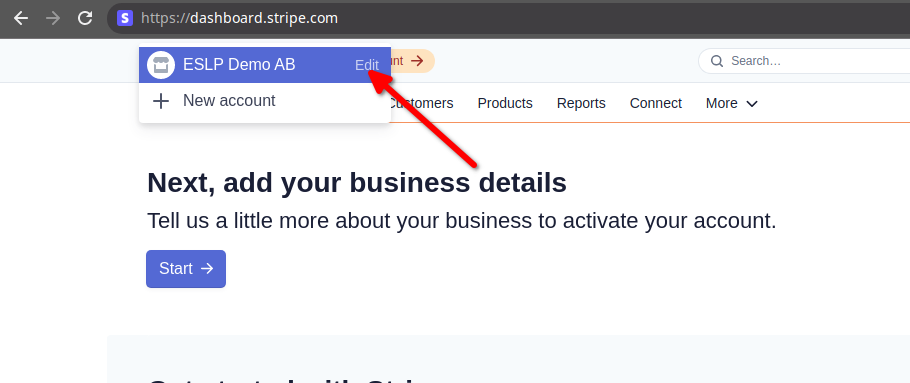
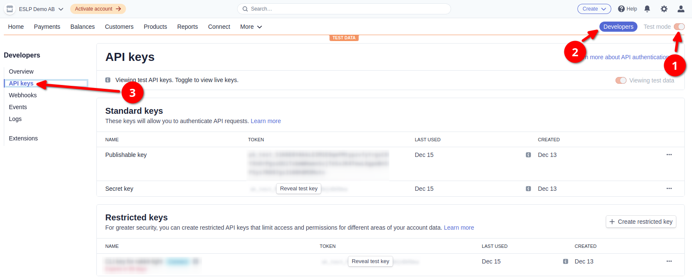
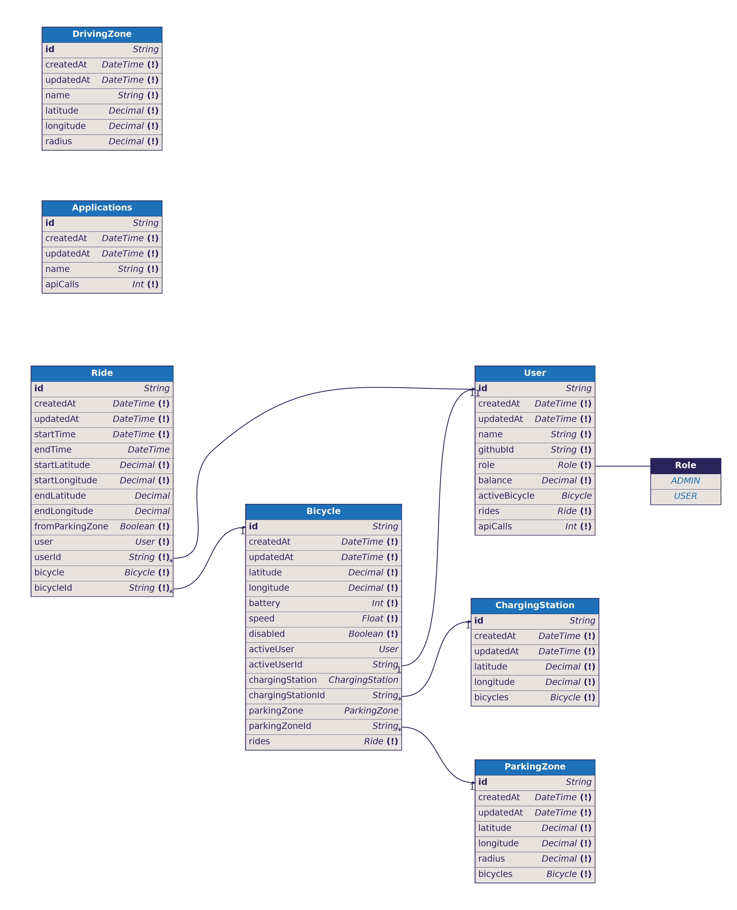

# Setup

<!-- conventional testawfa commit -->

1. Install dependencies
    ```bash
    npm install
   ```
1. [Create OAuth credentials for GitHub](#creating-oauth-credentials-for-github)
1. Copy `.env`-file
    ```bash
    cp .env.example .env
    ```
    Make sure to generate the app secret and fill out your newly generated OAuth
    credentials.
    ```bash
    openssl rand -hex 32
    ```
1. If you already have MySQL running using systemd, stop it:
    ```bash
    systemctl stop mysql.service
    ```
1. Start MySQL and Redis (for persistent login sessions)
    ```bash
    docker-compose up -d
    ```
1. Migrate the database. Note that MySQL can take a few seconds to start.
    ```bash
    npx prisma migrate dev
    ```
1. Start the application
    ```bash
    npm run dev
    ```

## Environment variables and Stripe

The API requires a few environment variables to run properly. A dotenv-file is used to quickly set environment variables. Start by copying the example envfile:

```bash
cp .env.example .env
```

When copied, use the command `openssl rand -hex 32` to generate a value for `APP_SECRET`. Then come back here and follow the remaining steps.

### Creating OAuth credentials for GitHub

To be able to autheticate against GitHub you'll need to generate a secret pair. You should follow [this
guide](https://docs.github.com/en/developers/apps/building-oauth-apps/creating-an-oauth-app) using the information below:

|Field|Value|
|-|-|
|Application name|Anything you like, I used `BTH pattern Group 14 local`|
|Homepage URL|`http://localhost:4000`|
|Application description|Anything you like, can be left empty|
|Authorization callback URL|`http://localhost:4000/auth/github/callback`|

When done, fill out `GITHUB_CLIENT_ID` and `GITHUB_CLIENT_SECRET`.

### Setting up Stripe

Stripe is not necessary to run the application, but it is to be able to test the billing functionality. It requires a few extra environment variables and optionally a webhook client.

#### Stripe credentials

First you must configure your Stripe credentials. This lets the application
create payments and invoices.

1. You need a account with Stripe. If you don't already, create one here: https://dashboard.stripe.com/register
2. When you've created your account you need to set a company name to be able to
   send invocies. When logged in to the dashboard
   (https://dashboard.stripe.com/), click the name in the top left and then
   "Edit" as shown in the screenshot. Then enter a suitable name.
    
3. Make sure "Test mode" is enabled, then go to "Developers" and finally "API keys".
    
4. Copy your "Publishable key" and "Secret key" and set them in your .env-file
    ```env
    STRIPE_SECRET_KEY="sk_test_xxx"
    STRIPE_PUBLISHABLE_KEY="pk_test_yyy"
    ```

### Stripe webhooks

Webhooks allow the application to know when a payment is completed. It can be left out, in which case the user has to click the "Pay now" button again after a payment is completed.

1. Install the Stripe CLI utillity. https://stripe.com/docs/stripe-cli#install
2. Before starting the API/backend, run the following command. This will allow
   Stripe to call your application:
    ```bash
    stripe listen --forward-to localhost:4000/payments/stripe/webhook
    ```
3. Copy the printed signing secret to your .env-file. It should start with
   `whsec_`.
    ```env
    STRIPE_WEBHOOK_SECRET="whsec_zzz"
    ```
4. Now you can start the API/backend. The webhook secret is usually the same between runs.

# UML / Database structure


